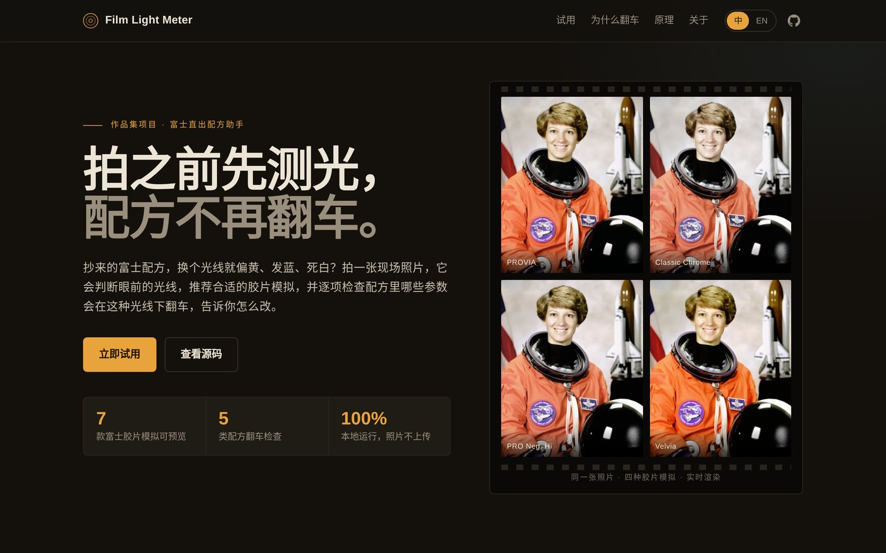
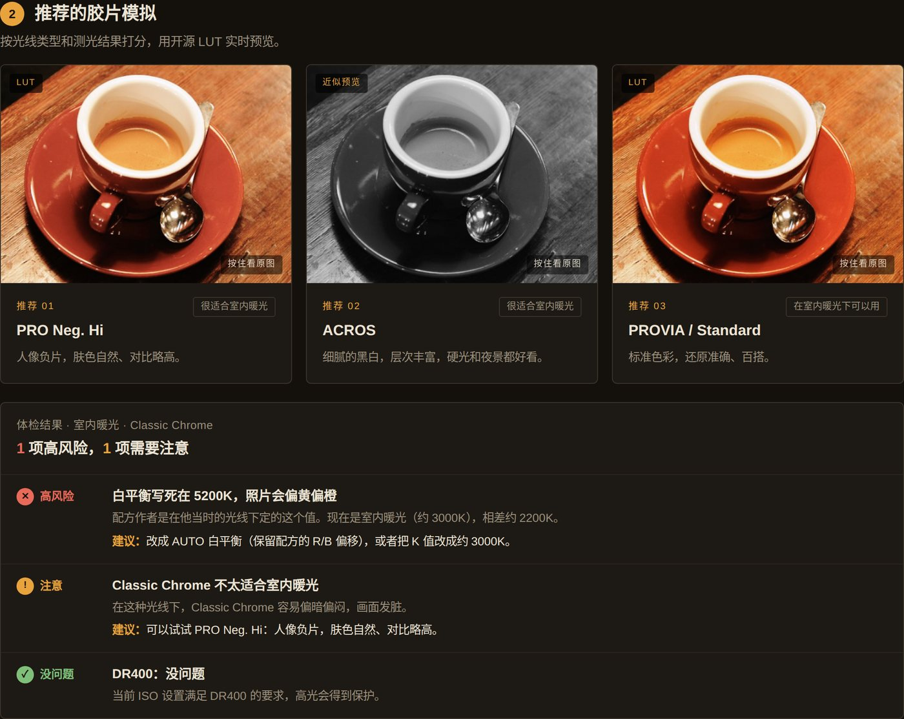

<div align="center">

# Film Light Meter · 富士直出配方助手

**拍之前先测光，配方不再翻车。**
判断眼前的光线，推荐合适的富士胶片模拟，并检查抄来的直出配方会不会在这种光线下"翻车"。

*Meter the light first. Stop ruining recipes.*

[**▶ 在线体验**](https://yunruilin99.github.io/filter-light-meter/) · [English](#english)



</div>

## 要解决的问题

富士相机的"直出配方"在国内很流行，但很多人照着配方设置后发现：照片偏黄、发蓝、高光死白，和原图差很远。查看配方作者和用户的讨论后，我发现原因大多和**光线**有关：

- **白平衡写死了 K 值**：配方里的 K 值只适合作者拍摄时的光线，换到室内暖光或阴天就会跑偏（[什么值得买](https://post.smzdm.com/p/aqrml7gk/)）
- **DR 与 ISO 的隐藏条件**：DR400 需要感光度不低于约 ISO 640，很多配方帖没写
- **不知道该用哪个**：最大的配方网站作者也承认，"什么场景用哪个配方"主要靠经验（[Fuji X Weekly](https://fujixweekly.com/2021/12/20/how-to-know-which-film-simulation-recipe-to-use/)）

现有的配方库只提供配方，配方生成器根据问卷生成配方（[PetaPixel](https://petapixel.com/2025/06/16/free-app-creates-the-perfect-custom-fujifilm-film-simulation-for-you/)），**但都不会测量你面前真实的光线**。

## 三步用法

1. **测光**：拍一张现场照片（手机上直接调用相机），估算色温、明暗和反差，自动判断光线类型（晴天、阴天、黄金时刻、室内暖光……）。判断不准可以直接点选
2. **选模拟**：按光线推荐 3 种胶片模拟，用 LUT 实时预览，按住预览图可以对比原图
3. **体检配方**：填入抄来的配方参数，逐项检查并给出分级提醒和具体改法：
   - 白平衡 K 值与现场光线的偏差
   - DR200 / DR400 的最低 ISO 要求
   - 强光下的高光死白、阴影死黑，阴天下的画面发灰
   - 暗光下的糊片和噪点风险
   - 胶片模拟和光线是否搭配



## 实现

原生 JavaScript（ES Modules），不需要构建步骤，全部在浏览器里运行，照片不上传。

```
assets/js/analyze.js   测光：色温估算、明暗、反差、饱和度
assets/js/sims.js      富士胶片模拟目录、光线类型、推荐打分
assets/js/checks.js    配方体检规则
assets/js/lut.js       .cube 解析与三线性插值渲染
assets/js/app.js       界面与交互
assets/js/i18n.js      中英文案
```

**关于准确性**：手机拍照会自动校正白平衡，所以从照片估算的色温只能作参考。这也是光线类型采用"自动判断 + 用户确认"的原因。预览用的是开源 LUT，属于近似效果，和机身直出会有差异。

## 项目是怎么来的

它最初是一个"按光线推荐 42 款胶片滤镜"的工具。做完后我问自己：它解决了谁的真实问题？和修图 App 庞大的滤镜库相比没有明显差异，拍胶片的老手也早就知道什么光用什么卷。于是我去查真实用户在讨论什么，发现了富士用户"抄配方翻车"的问题，并确认现有工具都不测量现场光线，于是把它重新定位成现在的拍摄前配方助手。最初的版本保留在提交历史里。

**我的角色**：独立完成需求验证与重新定位、交互与视觉设计、测光与体检规则的实现；开发中借助 AI 辅助编码，由我负责方向与审校。

**下一步**：找富士用户做实拍验证（同一配方修改前后对比）；读取照片 EXIF 里的模拟和白平衡设置，自动体检；补充 Classic Neg.、Nostalgic Neg. 等模拟的预览。

本地运行：`python3 -m http.server 8000`，然后打开 http://localhost:8000

## 致谢

- LUT 来自开源的 [G'MIC](https://gmic.eu/) 胶片模拟合集
- 示例照片来自 [scikit-image](https://scikit-image.org/docs/stable/api/skimage.data.html)（NASA / SpaceX 公有领域，Rachel Michetti、Stefan van der Walt CC0）
- FUJIFILM 及各胶片模拟名称是富士胶片的商标，本项目与其无关联

---

## English

**Film Light Meter** is a pre-shoot helper for Fujifilm shooters who copy "film simulation recipes". Recipes are tuned to their author's light, so a fixed Kelvin white balance or a DR400 setting without enough ISO often goes wrong in different conditions. Take a photo of the scene: the tool estimates the light, suggests suitable film simulations with live LUT previews, and checks each recipe setting (white balance drift, DR/ISO limits, tone settings in hard or flat light, low-light risks, simulation–light fit) with graded warnings and fixes. It runs entirely in the browser.

It began as a 42-film filter recommender. After finding it had no clear edge over photo apps' filter libraries, I looked for a real unmet need and repositioned it around recipe failures, which existing recipe libraries and generators don't address because none of them measure the actual light.

[Live demo](https://yunruilin99.github.io/filter-light-meter/?lang=en) · Author: Yunrui Lin
